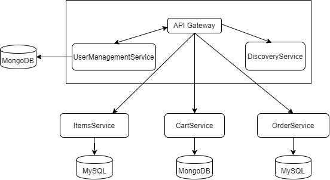

# Microservices-and-spring-boot-based-grocery-app
This application is a microservices architecture built with api gateway using spring security and JWT tokens for authentication. Spring boot based applications are clustered and integrated for different functionalities.

High Level Architecture: 

This application consist of 3 microservices namely : ItemService, CartService and OrderService.
All these three microservices are communicating via authorized JWT tokens which is managed by UserManagmentService and is also responsible for API gateway.

Databases used in the application are MySQL and mongoDB. For sake of simplicity, I have used docker containerized MySQL and MongoDB.
For docker configuration please look into ../dockerConfiguration/dockerConfig.txt

